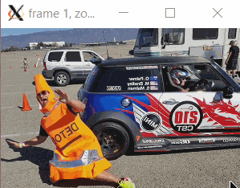
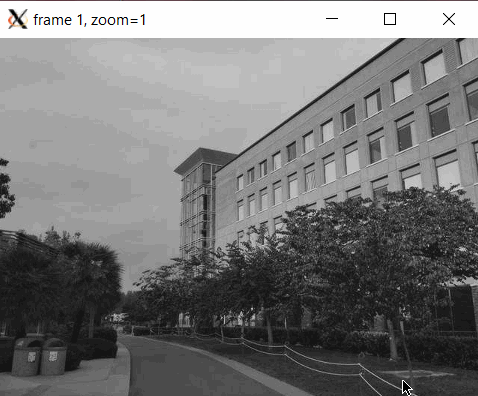
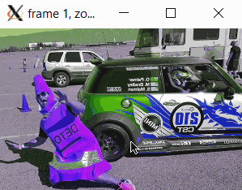
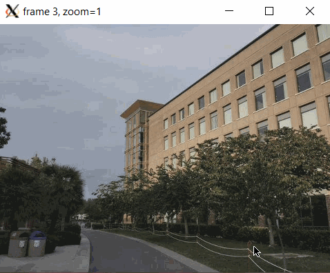

# **Movie Lab**
This program accepts an image or a movie as input, applies a filter selected by the user to the input and displays the output in the form of another movie. I used doubly linked lists and structures to create this project. The program accepts input from command line in a linux terminal. Debugging was done using gdb and Valgrind. 

## Built With
This program has been created in C and runs on the linux terminal. Additionally, it requires Xming to play the output movie.

## Usage
### With Image Input:
The user needs to enter the name of the image file, number of frames (determined by start, step, end), the filter - hue (hue) or bw (black and white) and the name of the output file. The output movie has frames from *start* value to *end* value. Each frame is the original image with a certain percent of the selected filter applied to it. This percent is *step* percent of the amount of *start*. The input arguments can be passed in any order. 

The following guide explains which arguments need to be passed if input is an image:-

* **-i** indicates input is an image. Must be followed by a string argument. 
* **-o** indicates argument following it is name of output movie.  
* **-start** indicates percent of filter applied to first frame. Must be followed by integer. 
* **-end** is used to calculate number of frames in output movie. Must be followed by an integer. 
* **-step** is used to calculate percent increase in filter application for each successive frame. Must be followed by an integer. 
* **hue** indicates 'hue' filter needs to be applied to each frame.  
* **bw**  indicates 'bw' filter needs to be applied to each frame. 

##### Note: Either *hue* or *bw* can be selected, but not both.

#### Example 1:
##### Input:
./MovieLab -i cone.ppm -o hue0.yuv -start 0 -end 66 -step 6 -hue

##### Output:

#### Example 2:
##### Input:
./MovieLab -bw -i EH.ppm -o bw0.yuv -end 10 -start 100 -step 15

##### Output:

### With Movie Input:
The user needs to input the name of the movie, number of frames, its size (widthxheight), size of each frame and name of the output movie. The user can also choose to apply the reverse filter, otherwise the output is the same as the input.

The following guide explains which arguments need to be passed if input is an image:-
* **-m** indicates input is a movie. Must be followed by name of the movie.  
* **-o** indicates name of output movie. Must be followed by string parameter. 
* **-f** indicates number of frames in the movie. Must be followed by integer argument.  
* **-s** indicates size of each frame. Must be specified as a string in the format widthxheight. 
* **-reverse** indicates output movie must be reverse of input movie. 

##### Note: *-reverse* is an optional argument. Without it, the ouput movie will be exactly the same as the input movie.

#### Example 1:
##### Input:
./MovieLab -m hue0.yuv -o reverse1.yuv -f 12 -s 300x200 -reverse

##### Output:

#### Example 2:
##### Input:
./MovieLab -m hue0.yuv -o reverse1.yuv -f 12 -s 300x200 -reverse

##### Output:

GIF created with [LiceCap](http://www.cockos.com/licecap/).

